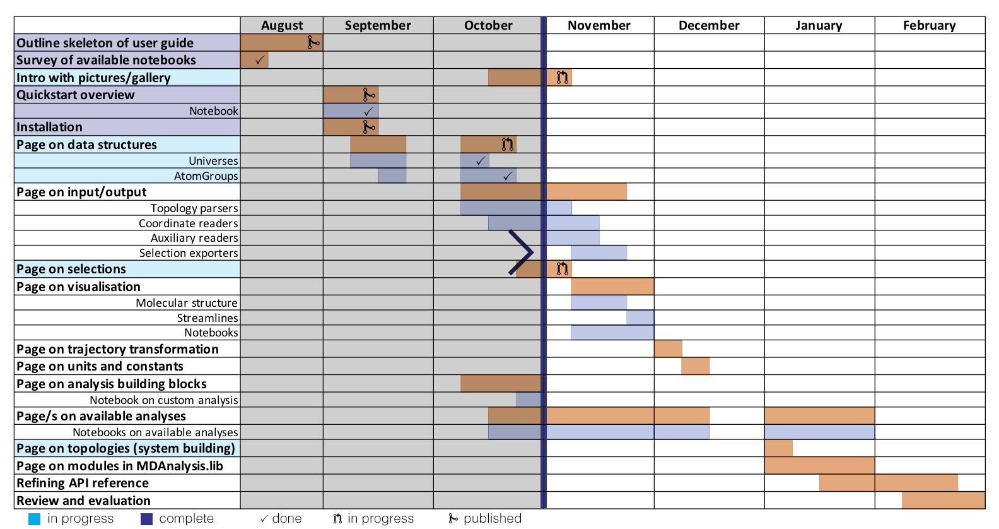
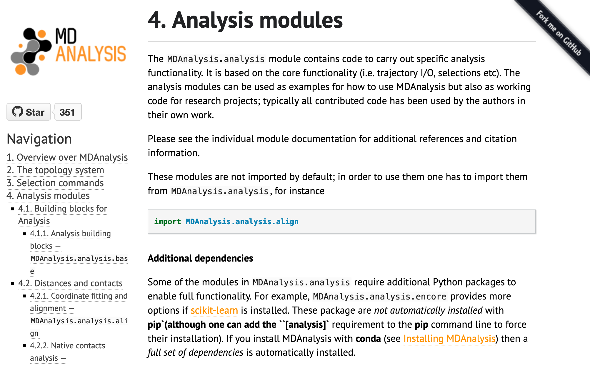
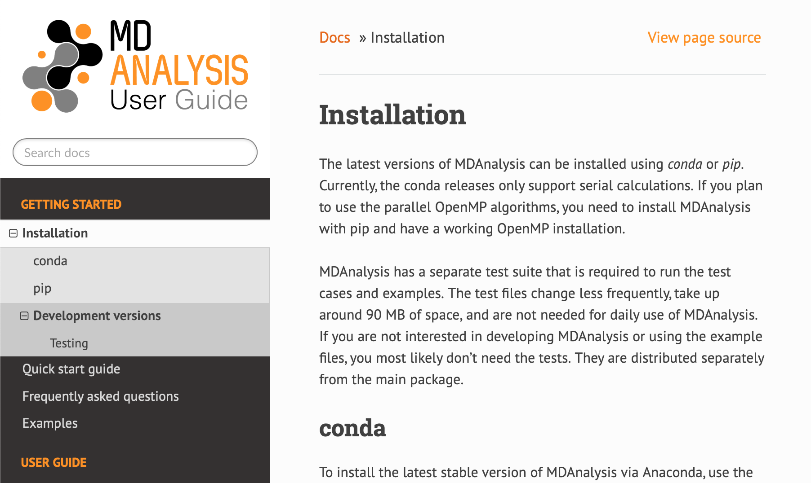

I'm approaching 3 months into [working with MDAnalysis on Google Season of Docs](http://blog.minium.com.au/intro-gsod/). Now seems like a good point to reflect, review, and plan.

## The community bonding phase

Over the community bonding phase, Oliver and Richard set up a new [repo](https://github.com/MDAnalysis/UserGuide) for the user guide, introduced me to the community, and collected a bunch of resources previously created for MDAnalysis. We met over Skype at 6am AU (+1) / 9pm UK / 1pm AZ to discuss expectations and imminent plans of action.

I looked at the MDAnalysis resources created for teaching MDAnalysis to get an idea for what the most important, fundamental basics are. I also reviewed every question posted on the [MDAnalysis user mailing list](https://groups.google.com/forum/#!forum/mdnalysis-discussion) from October 1st 2018 to August 31st. I picked this date because the last major release, 0.19.0, came out on October 10th. I also joined the group so I could be updated on any new issues. I collated notes on the [User guide wiki](https://github.com/MDAnalysis/UserGuide/wiki/Concepts-to-cover). 

Finally, I wrote up [two project deliverables](https://github.com/MDAnalysis/UserGuide/wiki/GSOD-Deliverables#september) I would begin to work on in September:

* Introductory pages
    * A page on install MDAnalysis
    * A quick start notebook
* Page on data structures
    * Overview of the core classes in MDAnalysis (Universe, AtomGroup, Topology and Trajectory)
    * Universe
    * AtomGroup
    * Other groups
    * Topology building

## Progress and reflection

The [user guide is available here.](https://www.mdanalysis.org/UserGuide)

Here is a visual representation of where I am up to in the project. I seem to be mostly on track, although I have not started pages on formats yet.

### Changes to the theme

One of the first, and more dramatic, contributions I made was to change the existing MDAnalysis docs theme from alabaster to ReadTheDocs, modified for the MDAnalysis colour scheme. 

The original theme of MDAnalysis documentation:

The new theme of the user guide:

I find the contrasting colours of the sidebar make the ReadTheDocs easier to read and navigate. I also like that the search bar is on the top left, rather than the bottom (as with alabaster, not shown).

### Introductory pages

I wrote a quick start guide to MDAnalysis as a downloadable notebook and used nbsphinx to display it on the user guide. 

When I first decided to make this a Jupyter notebook, I envisioned users downloading the notebook and playing around with the basic concepts introduced. Indeed, there are parts of common MDAnalysis task coded in (e.g. writing out trajectories, calculating and plotting RMSD). However, upon reflection, the notebook may be too large and wordy to be enticing as a lightweight introduction to MDAnalysis.

Nonetheless, I think it works well as a page in the user guide (although I suppose time will tell). Another benefit is that because the notebooks are reexecuted for the guide, a problem with the user guide can indicate a serious problem with the code.

### Data structures

I have written pages introducing Universes, AtomGroups, Groups of atoms, and atom selection language, which are ready to be merged.

Here is where I have fallen out of sync with the project timeline. I put together most of an introduction to Universes and AtomGroups; however, I quickly became sidetracked by also adding in pages on topologies and the atom selection language. This is because I found (and still find) it challenging to separate these concepts in a modular way. Topology attributes, selection language, and the idiosyncrasies of topology/coordinate format parsers are intertwined with the creation and behaviour of AtomGroups. As a result, the [data structures](https://github.com/MDAnalysis/UserGuide/pull/14) pull request has ballooned out into 10 commits with 20 changed files. 

I have decided that topology attributes deserve their own branch, so currently it is only waiting on the Jupyter notebook about constructing a Universe. This addresses concepts of building a Universe with `Universe.empty`, merging AtomGroups, and adding topology attributes. It is divided into subsections for easy linking and will be displayed using nbsphinx. 

I have found that creating this notebook clarified my thoughts and pointed out holes in my, and possibly the MDAnalysis developers', knowledge ([e.g. how to add bonds to a Universe](https://groups.google.com/forum/#!topic/mdnalysis-discussion/RjfVukZBPQM)). This has been helpful for planning out how to document different aspects of the topology and its attributes. 

### General

I am hopefully *too* behind on the format-specific input/output pages. While I haven't written anything for those yet, I have been collating notes on [topology attributes](https://github.com/MDAnalysis/UserGuide/wiki/Topology-attributes), which are very often format-specific. 

## Onwards

What's next after merging the data-structures branch?

### AtomGroup coordinate methods (1st priority)

I haven't fully documented AtomGroups, because I haven't addressed important methods such as `center()`, `unwrap()`, etc. I decided to move these to a separate page called "Working with Coordinates", which seems more thematic. This is still very sparse because I'm uncertain exactly what I can add beyond what's available in the API reference. A section on periodic boundary conditions is probably warranted. 

### API reference (low priority)

Relatedly, I would like to experiment with refining and organising the API reference into sections, and also move it into a ReadTheDocs theme. This currently lives in a local branch on my laptop and is likely to be a longer sub-project I can work on on-the-side.

### Topology attributes (high priority)

There's some confusion around Topology attributes at the moment. The data-structures branch does currently have a table of which attributes are available for which format, and unexpected behaviours (e.g. resids indexing from 0 for TPR files). However, the TopologyObjects section is still incomplete.

### Formats

This also needs to be documented. I am especially interested in how topology attributes get read from each format -- e.g. PSFParser subtracts 1 from the atom ID of a PSF parser. 

### Building some analysis notebooks

I would like to finish the PCA analysis notebook. The user mailing list has also been receiving some questions about radial distribution functions. 

## Summary

I've fallen mildly behind in the timeline, but I am roughly on-track in delivering pages on installation, data structures, and atom selection language, as well as notebooks for a quick start to MDAnalysis and constructing a universe. I have decided that topologies and topology attributes are of high importance to MDAnalysis and will focus on them over the pages on format input/output. I think example/demo notebooks are one of the clearest ways to impart information and will begin to create more of those. I will work on the pages on visualisation later in the project (although notebooks will already have molecular structure visualisation in them), as they don't appear to be high priority. The next steps outlined above will likely keep me busy until the end of November.